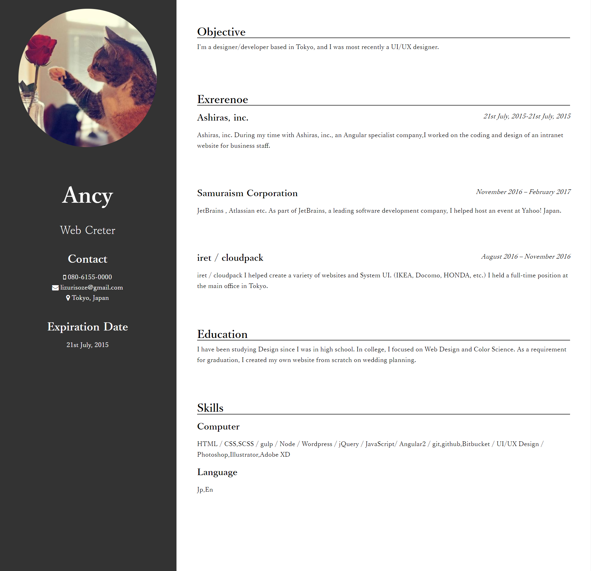

# Summarys

Summarys is a Summary(resume) generator. It can be saved as PDF.

## Demo
[View Demo](http://lazulirose.com/summarys-demo/)


You can save it as PDF too:

[View PDF](http://lazulirose.com/summarys-demo/Ancy's-summary.pdf)


## Installation

Note: Summarys uses Jekyll. Please read [Jekyll's documentation](https://jekyllrb.com/) if you get stuck.
Fork this repo, clone it, and then run:
```
bundle install
```
...which installs github-pages gem. After that, run the server:
```
jekyll srver
```
Please check with localhost.

# Usage

Editing Your Resume

Edit `_data/summary.yml` like this:

```
# personal
photo: "https://avatars3.githubusercontent.com/u/28818572?v=3&s=460"
name: "Ancy"
job: "Web Creter"

# Contact
tel: "080-6155-0000"
mail: "lizurisoze@gmail.com"
live: "Tokyo, Japan"

# Expiration Date
biz: "21st July, 2015"
```
---
Edit `_data/objective.yml`,`_data/education.yml` like this:

- `content: ""` is the contents 

---

Edit `_data/exrerenoe.yml` like this
- "company" is the company name
- "time" is in the period in which you worked 
- "contents" is the achievement or result

```
company_1: "Ashiras, inc."
time_1: "21st July, 2015-21st July, 2015"
content_1: "Ashiras, inc. During my time with Ashiras, inc., an Angular specialist company,I worked on the coding and design of an intranet website for business staff."

company_2 : "Samuraism Corporation"
time_2: "November 2016 – February 2017"
content_2: "JetBrains , Atlassian etc. As part of JetBrains, a leading software development company, I helped host an event at Yahoo! Japan."

company_3: "iret / cloudpack"
time_3: "August 2016 – November 2016"
content_3: "iret / cloudpack I helped create a variety of websites and System UI. (IKEA, Docomo, HONDA, etc.) I held a full-time position at the main office in Tokyo."
```

## Warning
1. To save to PDF, please use the browser save function
1. To print only one page, specify that page from the browser's print screen.


## Author & License

Ancy

- [Website](http://lazulirose.com/)
- [Twitter](https://twitter.com/lazulirose_ancy)
